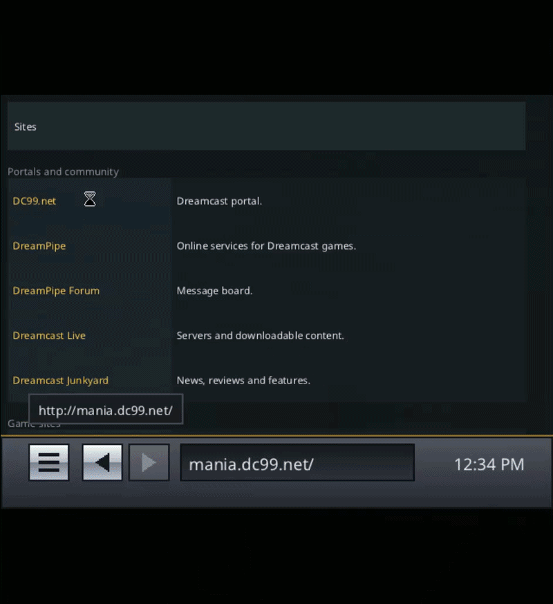

# POPSurf

POPSurf is an experimental web browser for the Sega Dreamcast. It uses
[litehtml](https://github.com/litehtml/litehtml) for HTML and CSS layout and
renders directly through the PowerVR hardware.

<p align="center">
  
</p>

The project runs on original hardware but is not ready for general use. There
are no packaged releases yet.

## Features

- GIF, JPEG, and PNG images
- HTTP/1.1 over the Broadband Adapter
- History, bookmarks, scrolling, and pointer control
- ADX, MIDI, and SWF audio
- SWF 4 rendering and ActionScript
- Java applets targeting the JDK 1.1 API

TLS, modem support, cookies, JavaScript, and multipart form uploads are not
implemented. See the
[compatibility matrix](Docs/dc-compat.md) for details.

## Build

Requires [KallistiOS](https://github.com/KallistiOS/KallistiOS), a supported
SH-4 toolchain, and GNU Make.

```sh
make
```

This produces `popsurf.elf`. To build `build/popsurf.cdi`, install `mkdcdisc`
and run:

```sh
make cdi
```

To set the start page during development:

```sh
make HOME_URL=file:///pc/test.html
```

## Test

```sh
make check-host
```

Hardware capture and comparison tools are documented in
[`tools/dccheck.sh`](tools/dccheck.sh).

## Source tree

| Path | Contents |
| --- | --- |
| `core/` | Documents, painting, text, images, and audio |
| `gfx/pvr/` | PowerVR renderer |
| `net/` | URL, file, HTTP, and loading code |
| `java/` | Java applet runtime |
| `swf/` | SWF parser, renderer, interpreter, and audio |
| `shell/` | Dreamcast browser shell |
| `tests/` | Host and hardware tests |
| `cd/` | Disc assets and hardware test pages |

## Documentation

- [Dreamcast compatibility](Docs/dc-compat.md)
- [Layout policy](Docs/layout-policy.md)
- [Licensing and provenance](Docs/licensing.md)

## License

Original POPSurf code is licensed under [0BSD](LICENSE). Bundled components
retain their own licenses; see [Docs/licensing.md](Docs/licensing.md).
